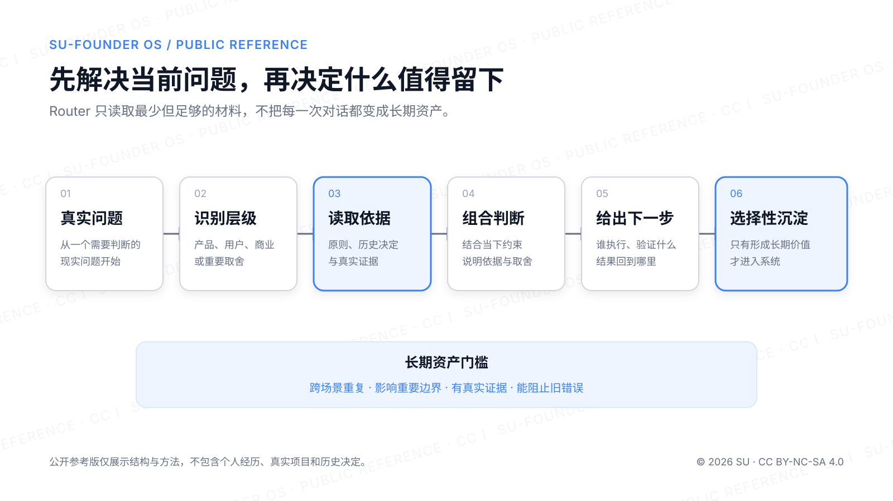

# Su-Founder OS｜公开参考版

> 让 AI 按需调用长期判断，而不只是记住过去的结论。

AI 可以越来越快地给方案、写内容和推进执行，但速度不会自动保存一个人为什么这样选择、主动放弃了什么，以及什么变化出现后值得重新评估。

Su-Founder OS 是一套个人判断操作系统。它不收集所有聊天，也不替人思考；它保存经过验证的原则、重要选择的理由、实验结果和可复用能力，让未来的自己与 AI 能够继续沿着同一条判断链工作。

这是 Su 在真实产品、商业判断与 AI 协作中逐步形成的个人系统的公开脱敏版。它不是标准答案，也不是可执行的软件项目，而是一套可以复制、删改和重新组织的方法与模板。



## 它与知识库有什么不同

| 知识库更擅长回答 | Founder OS 更擅长回答 |
|---|---|
| 我知道什么？ | 我为什么这样选？ |
| 有哪些资料、观点和方法？ | 当时有哪些约束、证据和取舍？ |
| 最后的结论是什么？ | 什么变化出现后值得重审？ |

Founder OS 保护的不是过去答案的永久正确，而是判断的连续性：看得见过去，理解得了现在，也保留主动改变的权利。

## 公开结构

| 模块 | 作用 |
|---|---|
| 判断底座 | 保存长期定位、价值原则与判断边界 |
| 产品判断 | 从真实场景、用户摩擦和证据走向功能取舍 |
| 用户与商业 | 理解用户阻力、购买触发和交付边界 |
| 决策记录 | 保存重要选择的理由与复查条件 |
| 实验与失败 | 记录假设、证据、停止条件和可迁移经验 |
| [AI 路由](docs/router-system.md) | 为当前问题调用最少但足够的长期上下文 |
| 执行接口 | 保存可复用提示、能力与交接方式 |
| 维护机制 | 管理捕获、验证、晋升与定期清理 |

上表描述的是一套 Founder OS 可能承担的判断层，不是本仓库的文件清单。当前公开版只提供两份空白模板、两套公开 Prompt、结构说明和通用方法；其他内容需要由你根据自己的真实经历逐步建立。

完整说明见 [《Founder OS 公开介绍》](docs/introduction.md)。

## 先选择你的起点

### 路线 A：你已经有一些原则、决定或复盘

1. 把需要的模板复制到自己的私密空间，例如本地 Markdown、Obsidian 或 Private Repo。
2. 用 [Decision Log](templates/decision-log.md) 记录重要取舍，用 [Experiment Review](templates/experiment-review.md) 记录真实验证。
3. 把已经确认的原则、边界和历史决定整理成 AI 可以按需读取的文件。
4. 使用下面的快捷调用处理当前问题。

```text
使用 Founder OS Router 分析下面的问题。
按需读取相关 Reference、Skill 与历史 Decision；
先解决当前问题，再判断是否值得沉淀：

[你的问题]
```

使用说明和缺失上下文的处理方式见 [《快捷调用》](docs/quick-call.md)。完整的通用路由规则与 Prompt 分别见 [《公开路由系统》](docs/router-system.md) 和 [Router Prompt](prompts/founder-os-router.md)。

### 路线 B：你还没有 Founder OS

复制下面这段 Prompt，让 AI 从一个真实问题开始陪你搭建最小可用版本：

```text
你是我的 Founder OS 搭建陪跑者。

你的任务不是复制 Su 的内容，也不是一次生成一套看似完整的空壳，
而是通过多轮对话，从我的真实经历、当前工作和重要决定中，
陪我搭建一个最小可用、能够持续演化的个人判断系统。

规则：
1. 每轮最多问我 3 个问题。
2. 允许我回答“不知道、说不清、你帮我判断”。
3. 可以从一个真实决定、一次失败实验或当前最难的问题开始。
4. 区分已确认事实、你的推断和仍待验证的假设，不得替我编造经历。
5. 先帮助我解决一个真实问题，再判断哪些内容值得长期保存。
6. 在创建目录或文件前，先复述你对我的理解并让我确认。
7. 只创建当前真正需要的最小结构，不要追求目录完整。

最终请帮我形成：
- 我的使用场景与边界；
- 已确认的长期原则；
- 第一份基于真实材料的 Decision Log 或 Experiment Review；
- 一个适合我的 Founder OS Router；
- 后续维护与隐私建议。

现在先给我 3 种低压力的开始方式，让我选择。不要直接生成最终系统。
```

需要更完整的交互、确认和文件生成规则时，使用 [Founder OS 搭建陪跑 Prompt](prompts/build-your-founder-os.md)。

## 你可以怎样改

- 只保留与你有关的模块，也可以修改目录、命名和顺序；
- 用自己的真实经历、原则、Decision 和 Experiment 替换公开示例，不要把 Su 的具体判断当成自己的结论；
- 先从能解决当前问题的最小结构开始，有真实内容后再增加模块；
- 把个人经历、客户资料、金额和未公开判断留在自己的私密空间；
- 如果公开发布改编版，需要保留来源、标明修改并遵守相同许可。

## 公开版不包含什么

这个仓库只公开结构、方法、空白模板和通用示例，不包含：

- 个人成长、家庭或身份经历；
- 真实产品、客户、金额和资源配置；
- 私人 Decision Log、失败记录和未公开商业判断；
- 本机路径、私密仓库、内部工具配置和历史提交。

公开版可以帮助你搭建自己的 Founder OS，但不会替你生成属于你的判断。真正有价值的内容必须来自你的真实经历、选择和验证。

## 使用边界

欢迎个人和非商业场景学习、复制、修改，并据此搭建自己的 Founder OS。

- 私人自用时，不要求公开署名，也不要求公开你的修改或个人内容；
- 公开转载或公开发布改编版时，需要保留来源、标明修改并使用同一许可；
- 付费课程、商业咨询、企业交付、会员资料、商业软件、SaaS 和其他主要面向商业利益的使用，需要事先获得书面授权。

本仓库采用 [CC BY-NC-SA 4.0](LICENSE.md)。具体边界见 [NOTICE](NOTICE.md)。

## 内容索引

- [Founder OS 公开介绍](docs/introduction.md)
- [Founder OS 公开路由系统](docs/router-system.md)
- [快捷调用](docs/quick-call.md)
- [Founder OS Router Prompt](prompts/founder-os-router.md)
- [Founder OS 搭建陪跑 Prompt](prompts/build-your-founder-os.md)
- [Decision Log 空白模板](templates/decision-log.md)
- [Experiment Review 空白模板](templates/experiment-review.md)
- [许可说明](LICENSE.md)
- [实际使用边界](NOTICE.md)
